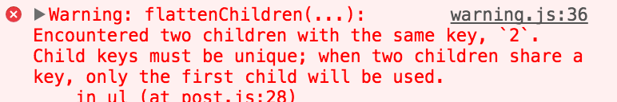

Keys are important when rendering collections of items in React. They are used under the hood by React to determine what needs to be rendered or re-rendered.

##React does not render duplicate keys.

Let's consider this array of numbers:

````javascript
const nums = [1, 2, 3, 5, 2];
````

(Notice the duplicate value, '2')

Now let's take that array, and render it:

````jsx
<ul>
  {nums.map(num => <li key={num}>{num}</li>)}
</ul>
````

Here we're just using the numbers themselves as the keys.

This snippet will create an element structure like this:

````html
<ul>
  <li key="1">1</li>
  <li key="2">2</li>
  <li key="3">3</li>
  <li key="5">5</li>
  <li key="2">2</li>
</ul>
````

React equates elements with matching keys, thus it will only render the first '2', since when it reaches the second element with a key of '2', it's already rendered an element that same key. React will even give you a nice warning:



The output DOM is then:
````html
<ul>
  <li>1</li>
  <li>2</li>
  <li>3</li>
  <li>5</li>
</ul>
````
(Notice the lack of the second 2)

This makes sense, because if you consider that the key is a _unique identifier_ for a conceptual element, react doesn't want to waste time rendering both. It's already rendered the canonical representation of the '2' element, so it doesn't do it again.

## React will re-render elements whose content has changed for a specific key.

React also re-renders elements whose key has changed for a specific element's contents, _even if the content hasn't changed_. These two cases are indistinguishable from React's point of view.

Sometimes developers using the index from a map function to populate the key of an element. Sometimes this is necessary, but it can also lead to performance issues in certain cases.

Let's look at how React will render this list of users when using the index as a key.

````jsx
const users = [
  {username:'bob'},
  {username:'sue'}
];

users.map((u, i) =>
  <div key={i}>{u.username}</div>);
````

This will render elements like:

````html
<div key="1">bob</div>
<div key="2">sue</div>
````

Now let's suppose that we add a user to the front of the list:

````jsx
const users = [
  {username:'joe'},
  {username:'bob'},
  {username:'sue'}
];

users.map((u, i) =>
  <div key={i}>{u.username}</div>);
````

This will render elements like:

````html
<div key="1">joe</div>
<div key="2">bob</div>
<div key="3">sue</div>
````

After we add another user, React will go into reconciliation, where it will update the dom depending on the shape of the elements returned from the component's render function. It does this by comparing the _new_ render result to the _previous_ one. If anything is different, React will go through with the expensive Dom update operation.

Here is the previous result of the operation compared to the new result:

````html
<div key="1">bob</div>   |  <div key="1">joe</div>
<div key="2">sue</div>   >  <div key="2">bob</div>
                         |  <div key="3">sue</div>
````

It's clear by looking at the two side by side that we've simply added "joe" to the beginning of the list.

What's the most efficient way to go from the previous dom structure to the next? Obviously, it's simply to add one dom element to the beginning, and leave the previous to unchanged. React cannot determine this, and it's because we've used the indices as our identifiers, (instead of basing that identifier on the actual content that is rendered).

From React's perspective, it looks like we've:

1. Changed the element with id "1" from bob to joe,
2. Changed the element with id "2" from sue to bob,
3. Added a new element with id "3", sue.

React will apply all three of these changes, instead of simply adding one.

## Choosing an appropriate key

A good key uniquely identifies the content of the element. If this is a user, this could be their id or username. Let's see what happens when we use the user's username as the key in our previous example.

````jsx
users.map((u, i) =>
  <div key={u.username}>{u.username}</div>);
````

Here are the two trees produced with the username as the key:

````html
<div key="bob">bob</div>   |  <div key="joe">joe</div>
<div key="sue">sue</div>   >  <div key="bob">bob</div>
                           |  <div key="sue">sue</div>
````

React now understands that the elements with keys "bob" and "sue" have remained unchanged, and we've simply re-introduced a new element with key "joe". React will now only apply one dom operation; adding an element to the beginning of the list.

The example given is a bit contrived, but consider instead if we were rendering a custom `<User />` component. When React notices a change in a particulars element's properties, it will invoke the corresponding lifecycle methods. The "bob" `User` component's `componentWillReceiveProps` would be invoked, and it would be given "joe" as its next props. This would be counterintuitive and confusing. Also consider if instead of simple divs, we had a complex tree of elements. Our app would waste a lot of time re-rendering entire trees that hadn't necessarily changed.

Choosing a good key identifier will not only prevent you from incurring performance degradations, but it will also keep you from encountering counterintuitive cases when rendering collections.
