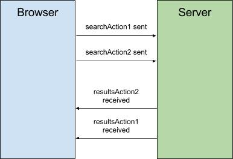

One type of error that causes bugs is race conditions. They are often hard to detect and reproduce since they only happen in special circumstances. If you're using redux to store your state, it's easy to write unit tests that account for these special circumstances.

Let's look at an example.

## The search results screen

Suppose we have a long list of items which is also filterable by a search text input. These search results are served by an api endpoint, at most 20 results at a time.

We have three actions defined to model this, an action that's dispatched whenever the user updates the text in the input:

```javascript
{
  "type": "UPDATED_SEARCH",
  "payload": "redu"
}
```

And one action that's emitted when the search request gets resolved:

```javascript
{
  "type": "RECEIVE_SEARCH_RESULTS",
  "payload": {
    "items": [ ... ]
  }
}
```

We have a simple reducer that returns a loading state when it receives an `UPDATED_SEARCH` action, and the loaded results state when it receives a `RECEIVE_SEARCH_RESULTS` action.

Let's write a unit test fit this and see how it t turns out.

## Writing a unit test for your reducer.

The functions that define how state changes in redux are called reducers due to their signature (the shape of a function's arguments and return value). If you take a look at how `array.reduce` is defined, it takes the previous sum, the current item, and returns the next sum.

```javascript
[1, 2, 3, 4].reduce((prevSum, currentItem) => {
  return prevSum + currentItem;
});
```
Here, the sum of the numbers is considered the 'sum' of the reduce.

The signature of the lambda here is exactly like that of our reducer. It takes a previous state (previous sum), an action (current item), and applies that action to the previous state, returning the next state:

```javascript
const searchReducer = (prevState, action) => {
  if(action.type === 'UPDATED_SEARCH'){
    return { loading: true };
  } else if(action.type === 'RECEIVE_SEARCH_RESULTS') {
    return {
      loading: false,
      items: action.payload.items
    };
  } else {
    return state;
  }
}
```


We can use our reducers in the same way if we think of the current state of our app as the "sum" of the reducer. If we have an array of actions, we could call reduce using our reducer, where the result would be the final state of our app after those actions are applied.

For example, Let's suppose our user came in and typed 'Red' (`searchAction1`), waited for some results (`resultsAction1`), and then refined their search to 'Redux' (`searchAction2`), and waited for more results (`resultsAction2`).

If we had variables for each of those actions, we can compute what the state _should_ look like after those actions have been applied: 

```javascript
const endState = [
  searchAction1,
  resultsAction1,
  searchAction2,
  resultsAction2
].reduce(searchReducer)

// should contain the items from the second result
endState.items
```

## The race condition

You've probably already noticed out the potential issue with our implementation. If not, suppose what would happen if the first search request took a very long time to resolve; so long, that the user didn't wait for the results and typed in a more exact query which returned _before_ the first request did.

Here's a graphic of the request timing:  




We can write another unit test for this case just by re-ordering our events:

```javascript
const endState = [
  searchAction1,
  searchAction2,
  resultsAction2,
  resultsAction1   <-- first results come in after second results
].reduce(searchReducer)

// should still contain the items from the resultsAction2
endState.items
```

The interface at this point should show the results from `resultsAction2`, but if we inspect the state of our app, we notice it contains the results of `resultAction1`!

This is known as a race condition, and it would be hard to detect since it only occurs when the results of the first request are returned 


## The solution

One simple way would be to attach timestamps to the `UPDATE_FILTER` and the corresponding `RECEIVE_SEARCH_RESULTS` action, and only applying actions with timestamps _after_ the last applied action.


It'd be a good idea to create one action creator that combines these action dispatches together. In practice this would look like:  

```javascript
function updateSearch(searchTerm) {
  const timestamp = new Date();
  return dispatch => {
    dispatch({
	  type: "UPDATED_SEARCH",
	  payload: {
	    searchTerm: searchTerm,
	    timestamp: timestamp
	  }
	});
	
	getResults('/api/search')
	  .then(results => {
	    dispatch({
		  type: "RECEIVE_SEARCH_RESULTS",
		  payload: {
		    items: results,
		    timestamp: timestamp
		  }
		})
	  ))
  }
}
```

Then, our reducer could be updated to simply discard actions which come with a timestamp before the most recent one: 

```javascript
function actionIsValid(state, action) {
  return action.payload.timestamp >= state.timestamp;
}
const searchReducer = (prevState, action) => {
  if(action.type === 'UPDATED_SEARCH' && actionIsValid(state, action)){
    return {
      loading: true,
      timestampe: action.payload.timestamp
    };
  } else if(action.type === 'RECEIVE_SEARCH_RESULTS' && actionIsValid(state, action)) {
    return {
      loading: false,
      timestampe: action.payload.timestamp
      items: action.payload.items
    };
  } else {
    return state;
  }
}
```

We re-run our tests, and they both pass!

The next time you're writing a unit test for a reducer, remember to include _all_ the possible action sequences that could happen, instead of just the ones you expect to happen.


